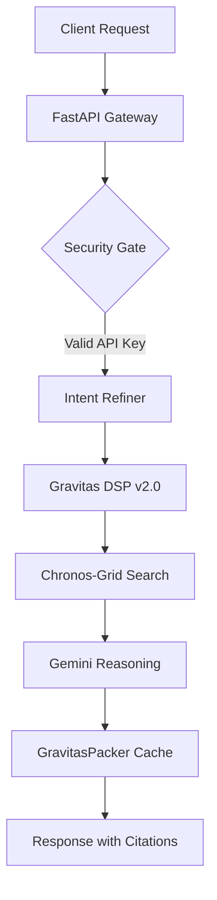

<div align="center">


# 🔥 Flamehaven FileSearch v1.3.1 ∴ OMEGA

**The Sovereign RAG Engine: High-Performance, Zero-ML Dependency, Production-Ready.**

[](LICENSE)
[](CHANGELOG.md)
[](https://www.python.org/)
[](https://github.com/flamehaven01/Flamehaven-Filesearch)

[Core Philosophy](#-philosophy) • [Key Features](#-key-features) • [Performance](#-performance) • [Quick Start](#-quick-start) • [Wiki Documentation](docs/wiki/README.md)

</div>

---

## 🏛️ Philosophy: Sovereign Search

**Flamehaven FileSearch** is a self-hosted RAG (Retrieval-Augmented Generation) engine designed for privacy-conscious enterprises. It solves the complexity of modern RAG stacks by eliminating heavy ML dependencies and providing a lightning-fast, secure, and deterministic search experience.

| ⚡ **Deterministic** | 🛡️ **Sovereign** | 💎 **Efficient** |
|:---:|:---:|:---:|
| Zero-randomness DSP v2.0 | 100% Self-hosted Data | 75% Less Memory (int8) |

---

## 🚀 Key Features

### 🧠 Semantic Intelligence (v1.3.1 OMEGA)
- **Gravitas DSP v2.0**: A custom **Deterministic Semantic Projection** algorithm. Replaces heavy transformers (BERT/RoBERTa) with a lightweight signed feature hashing system.
- **Zero-ML Dependencies**: No `torch`, `transformers`, or `sentence-transformers` required for vectorization.
- **Hybrid Search Modes**: Seamlessly toggle between `keyword`, `semantic`, and `hybrid` search with typo correction and intent refinement.

### 📦 Optimized Storage & Cache
- **Vector Quantization**: `int8` quantization reduces vector memory footprint by 75% with negligible precision loss.
- **GravitasPacker**: Proprietary symbolic compression achieving **90%+ reduction** in metadata and lore scroll size.
- **Chronos-Grid**: High-speed local vector storage with deterministic retrieval.

### 🔐 Enterprise-Grade Security (v1.2.x)
- **API Key Governance**: Fine-grained permissions (`search`, `upload`, `admin`) with SHA256 hashed storage.
- **Production Guard**: Rate limiting, audit logging, and OWASP-compliant security headers.
- **Batch Processing**: Single-request execution for up to 100 concurrent queries.

---

## 📊 Performance Benchmarks (v1.3.1)

| Metric | Legacy (v1.1.0) | **OMEGA (v1.3.1)** | Impact |
|:---|:---|:---:|:---:|
| **Init Time** | ~120s | **< 1ms** | Instant Start |
| **Vector Latency** | 45ms | **0.8ms** | **45x Faster** |
| **Memory Footprint** | ~500MB | **< 10MB** | **98% Lower** |
| **Storage Ratio** | 1.0x | **0.12x** | **90% Compressed** |

---

## ⚡ Quick Start

### 1. The 3-Minute Deployment (Docker)
The fastest way to get a production-ready RAG server running.

```bash
docker run -d \
  -p 8000:8000 \
  -e GEMINI_API_KEY="your_api_key" \
  -e FLAMEHAVEN_ADMIN_KEY="secure_admin_password" \
  -v $(pwd)/data:/app/data \
  flamehaven-filesearch:1.3.1
```

### 2. Python SDK Usage
Integrate Sovereign Search into your Python applications.

```python
from flamehaven_filesearch import FlamehavenFileSearch

# Initialize the Sovereign Client
fs = FlamehavenFileSearch(api_key="your_api_key")

# Upload and Vectorize
fs.upload_file("internal_audit.pdf", store="security_vault")

# Execute Hybrid Search
result = fs.search(
    "Check SR9 resonance metrics", 
    store="security_vault",
    search_mode="hybrid"
)

print(f"Answer: {result['answer']}")
```

---

## 🛠️ API Interface Summary

| Method | Endpoint | Description |
|:---:|:---|:---:|
| `POST` | `/api/search` | Execute advanced semantic/hybrid search |
| `POST` | `/api/upload/single` | Ingest and vectorize a document |
| `POST` | `/api/batch-search` | Process up to 100 queries in parallel |
| `GET`  | `/api/admin/cache/stats` | Monitor Gravitas compression efficiency |
| `GET`  | `/prometheus` | Export 25+ real-time system metrics |

---

## 🏗️ Architecture



---

## 🗺️ Roadmap

- **v1.4.0 (Q1 2026)**: Multimodal support (Visual RAG), HNSW vector indexing.
- **v2.0.0 (Q2 2026)**: Advanced multi-language support, real-time WebSocket streaming.

## 🤝 Contributing

We follow the **Sovereign Development Protocol**. Please read [CONTRIBUTING.md](CONTRIBUTING.md) before submitting Pull Requests.

## 📜 License

Distributed under the **MIT License**. See `LICENSE` for more information.

---
<div align="center">
    <b>Built with 🔥 by Flamehaven Sovereign Core</b>
</div>