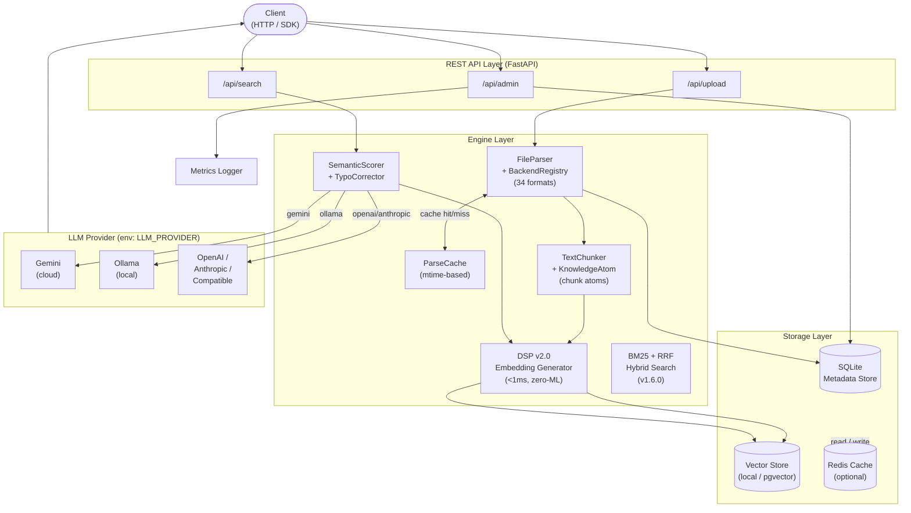

<div align="center">


# FLAMEHAVEN FileSearch

### Self-hosted RAG search engine. Production-ready in 3 minutes.

[](https://github.com/flamehaven01/Flamehaven-Filesearch/actions/workflows/ci.yml)
[](https://pypi.org/project/flamehaven-filesearch/)
[](https://pypi.org/project/flamehaven-filesearch/)
[](https://github.com/flamehaven01/Flamehaven-Filesearch/stargazers)
[](LICENSE)
[](https://www.python.org/)
[](https://github.com/psf/black)
[](https://hub.docker.com/r/flamehaven/filesearch)

[Quick Start](#-quick-start) • [Features](#-features) • [Documentation](#-documentation) • [API Reference](http://localhost:8000/docs) • [Contributing](#-contributing)

</div>

---

## 🎯 Why FLAMEHAVEN FileSearch?

Stop sending your sensitive documents to third-party services. FLAMEHAVEN FileSearch is a production-grade RAG search engine — BM25+hybrid retrieval, 34 file formats, multi-LLM (Gemini, OpenAI, Claude, Ollama) — running self-hosted in minutes, not days.

```bash
# Gemini (cloud) — one command, three minutes
docker run -d -p 8000:8000 -e GEMINI_API_KEY="your_key" flamehaven-filesearch:1.6.1

# Ollama — fully local, zero API cost (Gemma, Llama, Mistral, Qwen, Phi …)
# Step 1: pull a model  →  ollama pull gemma4:27b
docker run -d -p 8000:8000 \
  -e LLM_PROVIDER=ollama \
  -e LOCAL_MODEL=gemma4:27b \
  -e OLLAMA_BASE_URL=http://host.docker.internal:11434 \
  flamehaven-filesearch:1.6.1
```

<table>
<tr>
<td width="33%" align="center">
<h3>🚀 Fast</h3>
<p>Production deployment in 3 minutes<br/>
Vector generation in &lt;1ms<br/>
Zero ML dependencies</p>
</td>
<td width="33%" align="center">
<h3>🔒 Private</h3>
<p>100% self-hosted<br/>
Your data never leaves your infrastructure<br/>
Enterprise-grade security</p>
</td>
<td width="33%" align="center">
<h3>💰 Cost-Effective</h3>
<p>Free tier: 1,500 queries/month<br/>
No infrastructure costs<br/>
Open source & MIT licensed</p>
</td>
</tr>
</table>

---

## Features ✨

### Core Capabilities

| Capability | Detail |
|---|---|
| **Search Modes** | Keyword, semantic, and hybrid (BM25+RRF) with automatic typo correction |
| **Quality Gate** | Confidence-scored hybrid results (PASS/FORGE/INHIBIT). FORGE augments with keyword fallback; INHIBIT flags `low_confidence`. Self-adapting BM25 pool via EMA meta-learner. Zero new dependencies. |
| **Obsidian Light Mode** | Markdown-first vault ingest with frontmatter, aliases, tags, wikilinks, heading-aware chunking, context enrichment, exact note resolution |
| **34 File Formats** | PDF, DOCX/DOC, XLSX, PPTX, RTF, HTML, CSV, LaTeX, WebVTT, images + plain text — see [Document Parsing](docs/wiki/Document_Parsing.md) |
| **RAG Pipeline** | Structure-aware chunking, KnowledgeAtom 2-level indexing, sliding-window context enrichment, mtime parse cache |
| **Ultra-Fast Vectors** | DSP v2.0 generates embeddings in <1ms — no ML frameworks required |
| **Source Attribution** | Every answer links back to the originating document and chunk |
| **Framework SDKs** | LangChain, LlamaIndex, Haystack, CrewAI adapters out of the box |
| **Enterprise Auth** | API key hashing (SHA256+salt), OAuth2/OIDC, fine-grained permissions |
| **Admin Dashboard** | Real-time metrics, quota management, batch processing (1–100 queries) |
| **Flexible Storage** | SQLite (default) · PostgreSQL + pgvector · Redis cache (optional) |

> **What changed in each release?** See [CHANGELOG.md](CHANGELOG.md) for the full version history.

---

## Quick Start 🚀

### Option 1: Docker (Recommended)

The fastest path to production:

```bash
docker run -d \
  -p 8000:8000 \
  -e GEMINI_API_KEY="your_gemini_api_key" \
  -e FLAMEHAVEN_ADMIN_KEY="secure_admin_password" \
  -v $(pwd)/data:/app/data \
  flamehaven-filesearch:1.6.1
```

✅ Server running at `http://localhost:8000`

### Option 2: Python SDK

Perfect for integrating into existing applications:

```python
from flamehaven_filesearch import FlamehavenFileSearch, FileSearchConfig

# Initialize
config = FileSearchConfig(google_api_key="your_gemini_key")
fs = FlamehavenFileSearch(config)

# Upload and search
fs.upload_file("company_handbook.pdf", store="docs")
result = fs.search("What is our remote work policy?", store="docs")

print(result['answer'])
# Output: "Employees can work remotely up to 3 days per week..."
```

### Option 3: REST API

For language-agnostic integration:

```bash
# 1. Generate API key
curl -X POST http://localhost:8000/api/admin/keys \
  -H "X-Admin-Key: your_admin_key" \
  -d '{"name":"production","permissions":["upload","search"]}'

# 2. Upload document
curl -X POST http://localhost:8000/api/upload/single \
  -H "Authorization: Bearer sk_live_abc123..." \
  -F "file=@document.pdf" \
  -F "store=my_docs"

# 3. Search
curl -X POST http://localhost:8000/api/search \
  -H "Authorization: Bearer sk_live_abc123..." \
  -H "Content-Type: application/json" \
  -d 
  '{ 
    "query": "What are the main findings?",
    "store": "my_docs",
    "search_mode": "hybrid"
  }'
```

---

## 📦 Installation

```bash
# Core package (HTML, CSV, LaTeX, WebVTT, plain-text parsing included — zero extra deps)
pip install flamehaven-filesearch

# + Document parsers: PDF (pymupdf/pypdf), DOCX, XLSX, PPTX, RTF
pip install flamehaven-filesearch[parsers]

# + Image OCR (Pillow + pytesseract; requires Tesseract system binary)
pip install flamehaven-filesearch[vision]

# + Google Gemini API
pip install flamehaven-filesearch[google]

# + REST API server (FastAPI + uvicorn)
pip install flamehaven-filesearch[api]

# + HNSW vector index
pip install flamehaven-filesearch[vector]

# + PostgreSQL backend
pip install flamehaven-filesearch[postgres]

# Everything
pip install flamehaven-filesearch[all]

# Build from source
git clone https://github.com/flamehaven01/Flamehaven-Filesearch.git
cd Flamehaven-Filesearch
docker build -t flamehaven-filesearch:1.6.1 .
```

### Framework Integrations

Framework SDKs (LangChain, LlamaIndex, etc.) are imported lazily — install only
what you need:

```python
# LangChain  (pip install langchain-core)
from flamehaven_filesearch.integrations import FlamehavenLangChainLoader
docs = FlamehavenLangChainLoader("report.pdf", chunk=True).load()

# LlamaIndex  (pip install llama-index-core)
from flamehaven_filesearch.integrations import FlamehavenLlamaIndexReader
nodes = FlamehavenLlamaIndexReader(chunk=True).load_data(["report.pdf", "slides.pptx"])

# Haystack  (pip install haystack-ai)
from flamehaven_filesearch.integrations import FlamehavenHaystackConverter
result = FlamehavenHaystackConverter().run(sources=["report.pdf"])

# CrewAI  (pip install crewai)
from flamehaven_filesearch.integrations import FlamehavenCrewAITool
tool = FlamehavenCrewAITool()           # pass to your agent's tools list
```

---

## Configuration ⚙️

### LLM Provider Selection

FLAMEHAVEN supports four LLM backends — switch with a single env var:

| `LLM_PROVIDER` | Required variables | Notes |
|---|---|---|
| `gemini` (default) | `GEMINI_API_KEY` | Google Gemini file-search API |
| `ollama` | `LOCAL_MODEL`, `OLLAMA_BASE_URL` | Local inference via Ollama — Gemma 4/3, Llama 3.2, Qwen 2.5, Mistral, Phi-4 … |
| `openai` | `OPENAI_API_KEY` | OpenAI or any OpenAI-compatible endpoint |
| `anthropic` | `ANTHROPIC_API_KEY` | Anthropic Claude |
| `openai_compatible` | `OPENAI_API_KEY`, `OPENAI_BASE_URL` | vLLM, LM Studio, Kimi, etc. |

```bash
# Gemini (default)
export GEMINI_API_KEY="your_google_gemini_api_key"

# Ollama (fully local)
export LLM_PROVIDER=ollama
export LOCAL_MODEL=gemma4:27b          # or gemma4:4b, qwen2.5:7b, llama3.2 …
export OLLAMA_BASE_URL=http://localhost:11434

# OpenAI
export LLM_PROVIDER=openai
export OPENAI_API_KEY="sk-..."
export DEFAULT_MODEL=gpt-4o-mini       # optional override

# Anthropic
export LLM_PROVIDER=anthropic
export ANTHROPIC_API_KEY="sk-ant-..."
```

### Required Environment Variables

```bash
export FLAMEHAVEN_ADMIN_KEY="your_secure_admin_password"
# Plus the provider credentials above (at least one provider)
```

### Optional Configuration

```bash
export HOST="0.0.0.0"              # Bind address
export PORT="8000"                  # Server port
export REDIS_HOST="localhost"       # Distributed caching
export REDIS_PORT="6379"            # Redis port
export MAX_OUTPUT_TOKENS="1024"     # Max answer tokens
export TEMPERATURE="0.5"            # Model temperature (0.0–1.0)
export MAX_SOURCES="5"              # Max source documents per answer
```

### Obsidian / Local Vault Configuration

For Markdown-heavy vaults, enable Obsidian light mode:

```bash
export OBSIDIAN_LIGHT_MODE=true
export OBSIDIAN_CHUNK_MAX_TOKENS=256
export OBSIDIAN_CHUNK_MIN_TOKENS=32
export OBSIDIAN_CONTEXT_WINDOW=1
export OBSIDIAN_RESPLIT_CHUNK_CHARS=1200
export OBSIDIAN_RESPLIT_OVERLAP_CHARS=160
```

This path preserves note structure and improves retrieval on dense vaults with many related notes. Operational details: [Obsidian Light Mode](docs/wiki/Obsidian_Light_Mode.md)

### Advanced Configuration

Create a `config.yaml` for fine-tuned control:

```yaml
vector_store:
  quantization: int8
  compression: gravitas_pack
  
search:
  default_mode: hybrid
  typo_correction: true
  max_results: 10
  
security:
  rate_limit: 100  # requests per minute
  max_file_size: 52428800  # 50MB
```

---

## 📊 Performance

<table>
<tr>
<th>Metric</th>
<th>Value</th>
<th>Notes</th>
</tr>
<tr>
<td>Vector Generation</td>
<td><code>&lt;1ms</code></td>
<td>DSP v2.0, zero ML dependencies</td>
</tr>
<tr>
<td>Memory Footprint</td>
<td><code>75% reduced</code></td>
<td>Int8 quantization vs float32</td>
</tr>
<tr>
<td>Metadata Size</td>
<td><code>90% smaller</code></td>
<td>Gravitas-Pack compression</td>
</tr>
<tr>
<td>Test Suite</td>
<td><code>476 tests</code></td>
<td>All passing (pytest)</td>
</tr>
<tr>
<td>Cold Start</td>
<td><code>3 seconds</code></td>
<td>Docker container ready</td>
</tr>
</table>

### Real-World Benchmarks

```
Environment: Docker on Apple M1 Mac, 16GB RAM
Document Set: 500 PDFs, ~2GB total

Health Check:           8ms
Search (cache hit):     9ms
Search (cache miss):    1,250ms  (includes Gemini API call)
Batch Search (10):      2,500ms  (parallel processing)
Upload (50MB file):     3,200ms  (with indexing)
```

---

## Architecture 🏗️


```mermaid
flowchart TD
    Client(["Client\n(HTTP / SDK)"])

    subgraph API["REST API Layer (FastAPI)"]
        Upload["/api/upload"]
        Search["/api/search"]
        Admin["/api/admin"]
    end

    subgraph Engine["Engine Layer"]
        FP["FileParser\n+ BackendRegistry\n(34 formats)"]
        Cache["ParseCache\n(mtime-based)"]
        Chunker["TextChunker\n+ KnowledgeAtom\n(chunk atoms)"]
        DSP["DSP v2.0\nEmbedding Generator\n(&lt;1ms, zero-ML)"]
        BM25["BM25 + RRF\nHybrid Search\n(v1.6.0)"]
        Scorer["SemanticScorer\n+ TypoCorrector"]
    end

    subgraph Storage["Storage Layer"]
        SQLite[("SQLite\nMetadata Store")]
        Vec[("Vector Store\n(local / pgvector)")]
        Redis[("Redis Cache\n(optional)")]
    end

    subgraph LLM["LLM Provider (env: LLM_PROVIDER)"]
        Gemini["Gemini\n(cloud)"]
        Ollama["Ollama\n(local)"]
        OAI["OpenAI /\nAnthropic /\nCompatible"]
    end
    Metrics["Metrics Logger"]

    Client --> Upload & Search & Admin
    Upload --> FP
    FP <-->|"cache hit/miss"| Cache
    FP --> Chunker
    Chunker --> DSP
    DSP --> Vec
    FP --> SQLite

    Search --> Scorer
    Scorer --> DSP
    DSP --> Vec
    Scorer -->|"gemini"| Gemini
    Scorer -->|"ollama"| Ollama
    Scorer -->|"openai/anthropic"| OAI
    LLM --> Client

    Admin --> Metrics
    Admin --> SQLite
    Storage <-->|"read / write"| Redis
```

> Full layer detail: [Architecture.md](docs/wiki/Architecture.md)

---

## Security 🔒

FLAMEHAVEN takes security seriously:

- ✅ **API Key Hashing** - SHA256 with salt
- ✅ **Rate Limiting** - Per-key quotas (default: 100/min)
- ✅ **Permission System** - Granular access control
- ✅ **Audit Logging** - Complete request history
- ✅ **OWASP Headers** - Security headers enabled by default
- ✅ **Input Validation** - Strict file type and size checks

### Security Best Practices

```bash
# Use strong admin keys
export FLAMEHAVEN_ADMIN_KEY=$(openssl rand -base64 32)

# Enable HTTPS in production
# (use nginx/traefik as reverse proxy)

# Rotate API keys regularly
curl -X DELETE http://localhost:8000/api/admin/keys/old_key_id \
  -H "X-Admin-Key: $FLAMEHAVEN_ADMIN_KEY"
```

---

## Roadmap 🗺️

Full roadmap: [ROADMAP.md](ROADMAP.md)

### v1.4.x (Completed)
- [x] Multimodal search (image + text)
- [x] HNSW vector indexing for faster search
- [x] OAuth2/OIDC integration
- [x] PostgreSQL backend (metadata + pgvector)
- [x] Usage-budget controls and reporting
- [x] pgvector tuning and reliability hardening
- [x] CI/CD — ruff replaces flake8; pipelines fully green

### v1.5.x (Completed)
- [x] Universal Document Parser — 34 formats, zero doc-AI dependency (v1.5.0)
- [x] Internal text chunker — structure-aware + token-aware, zero ML deps (v1.5.0)
- [x] Framework integrations — LangChain, LlamaIndex, Haystack, CrewAI (v1.5.0)
- [x] Backend Plugin Architecture — `AbstractFormatBackend` + `BackendRegistry` (v1.5.2)
- [x] Parse cache — mtime-based, `extract_text(use_cache=True)` (v1.5.2)
- [x] ContextExtractor — sliding-window RAG chunk enrichment (v1.5.2)
- [x] Multi-provider LLM support — OpenAI, Claude, Ollama, Gemini (v1.5.3)

### v1.6.0 (Completed)
- [x] BM25 + RRF hybrid search — Korean+English tokenizer, lazy per-store index
- [x] KnowledgeAtom 2-level indexing — chunk atoms with fragment URIs
- [x] Stable URI scheme — `local://<store>/<quote(abs_path)>`, collision-free
- [x] core.py mixin segmentation — 1258 → 221 lines, 3 focused modules
- [x] Fix: `search_stream` double intent-refine bug

### v1.6.1 (Completed)
- [x] CC reduction — `seek_vector_resonance` CC 8→2, `_get_admin_user` CC 10→1
- [x] Dispatch table pattern — `_transform_dict` unifies GravitasPacker compress/decompress
- [x] `_record_upload_failure` helper — eliminates 2× duplicated metrics blocks in api.py
- [x] `/health` exposes `llm_provider` + `llm_model` — frontend can detect active backend
- [x] `config.to_dict()` exposes `llm_provider`, `local_model`, `ollama_base_url`
- [x] Frontend: provider-aware model selector (Gemini dropdown ↔ local model badge)
- [x] Frontend: upload accept list expanded to all 34 supported formats
- [x] Frontend: store datalist auto-populated from `/api/metrics`
- [x] Frontend: version badge synced to `v1.6.1` across all 6 dashboard pages
- [x] Ruff F401/F841 — 5 lint errors resolved, CI green
- [x] Admin: Stores tab — create / list / delete stores (`POST|GET|DELETE /api/stores`)
- [x] Admin: Ops tab — usage stats (`GET /api/admin/usage`) + vector ops (stats / reindex / vacuum)
- [x] Landing: "Manage" deep-link to `admin.html#stores` with hash-based tab routing

### v1.6.2 (Completed)
- [x] `engine/quality_gate.py` — `SearchQualityGate` (PASS/FORGE/INHIBIT), `SearchMetaLearner` (EMA alpha adaptation), `compute_search_confidence` (BM25/semantic agreement score with residual floor — `raw_rrf × max(floor, (overlap+coverage)/2)` — zero new deps)
- [x] Hybrid search: confidence-scored results with FORGE keyword augmentation and INHIBIT flag
- [x] `search_confidence` + `low_confidence` fields in search response schema
- [x] BM25 pool size self-adapts via meta-learner alpha (keyword-dominant → larger pool)
- [x] 25 tests, 99% coverage on `quality_gate.py`

### v2.0.0 (Q3 2026)
- [ ] Multi-language support (15+ languages) — multilingual stopwords + jieba
- [ ] Kubernetes Helm charts
- [ ] Distributed indexing

---

## Troubleshooting 🐛

<details>
<summary><b>❌ 401 Unauthorized Error</b></summary>

**Problem:** API returns 401 when making requests.

**Solutions:**
1. Verify `FLAMEHAVEN_ADMIN_KEY` environment variable is set
2. Check `Authorization: Bearer sk_live_...` header format
3. Ensure API key hasn't expired (check admin dashboard)

```bash
# Debug: Check if admin key is set
echo $FLAMEHAVEN_ADMIN_KEY

# Regenerate API key
curl -X POST http://localhost:8000/api/admin/keys \
  -H "X-Admin-Key: $FLAMEHAVEN_ADMIN_KEY" \
  -d '{"name":"debug","permissions":["search"]}'
```
</details>

<details>
<summary><b>🐌 Slow Search Performance</b></summary>

**Problem:** Searches taking >5 seconds.

**Solutions:**
1. Check cache hit rate: `FLAMEHAVEN_METRICS_ENABLED=1 curl http://localhost:8000/metrics`
2. Enable Redis for distributed caching
3. Verify Gemini API latency (should be <1.5s)

```bash
# Enable Redis caching
docker run -d --name redis redis:7-alpine
export REDIS_HOST=localhost
```
</details>

<details>
<summary><b>💾 High Memory Usage</b></summary>

**Problem:** Container using >2GB RAM.

**Solutions:**
1. Enable Redis with LRU eviction policy
2. Reduce max file size in config
3. Monitor with Prometheus endpoint

```bash
# Configure Redis memory limit
docker run -d \
  -p 6379:6379 \
  redis:7-alpine \
  --maxmemory 512mb \
  --maxmemory-policy allkeys-lru
```
</details>

More solutions in our [Wiki Troubleshooting Guide](docs/wiki/Troubleshooting.md).

---

## Documentation 📚

### Documentation Hub

Use the links below to jump to the most relevant guide.

| Topic | Description |
|-------|-------------|
| [Document Parsing](docs/wiki/Document_Parsing.md) | Supported formats, internal parsers, RAG chunking |
| [Hybrid Search](docs/wiki/Hybrid_Search.md) | BM25+RRF, KnowledgeAtom indexing, stable URI scheme (v1.6.0) |
| [Obsidian Light Mode](docs/wiki/Obsidian_Light_Mode.md) | Markdown-first vault ingest, exact note resolution, dense-note retrieval tuning |
| [Framework Integrations](docs/wiki/Framework_Integrations.md) | LangChain, LlamaIndex, Haystack, CrewAI adapters |
| [API Reference](docs/wiki/API_Reference.md) | REST endpoints, payloads, rate limits |
| [Architecture](docs/wiki/Architecture.md) | How all layers fit together (v1.6.0) |
| [Configuration Reference](docs/wiki/Configuration.md) | Full list of environment variables and config fields |
| [Production Deployment](docs/wiki/Production_Deployment.md) | Docker, systemd, reverse proxy, scaling tips |
| [Troubleshooting](docs/wiki/Troubleshooting.md) | Step-by-step debugging playbook |
| [Benchmarks](docs/wiki/Benchmarks.md) | Performance measurements and methodology |
| [Release and Tagging](docs/wiki/Release_and_Tagging.md) | Release checklist, tag policy, and next tag guidance |

These Markdown files live inside the repository so they stay versioned alongside the code. Feel free to contribute improvements via pull requests.

### Additional Resources

- **[Interactive API Docs](http://localhost:8000/docs)** - OpenAPI/Swagger interface (when server is running)
- **[CHANGELOG](CHANGELOG.md)** - Version history and release notes
- **[Docs Hub](docs/wiki/README.md)** - Versioned documentation index
- **[CONTRIBUTING](CONTRIBUTING.md)** - How to contribute code
- **[Examples](examples/)** - Sample integrations and use cases

---

## Contributing 🤝

We love contributions! FLAMEHAVEN is better because of developers like you.

### Good First Issues

- 🟢 **[Easy]** Add dark mode to admin dashboard (1-2 hours)
- 🟡 **[Medium]** PostgreSQL backend for usage tracker (multi-instance deployments)
- 🔴 **[Advanced]** Kubernetes Helm charts for production deployment

See [CONTRIBUTING.md](CONTRIBUTING.md) for development setup and guidelines.

### Contributors

<a href="https://github.com/flamehaven01/Flamehaven-Filesearch/graphs/contributors">
  
</a>

---

## Community & Support 💬

- **💬 Discussions:** [GitHub Discussions](https://github.com/flamehaven01/Flamehaven-Filesearch/discussions)
- **🐛 Bug Reports:** [GitHub Issues](https://github.com/flamehaven01/Flamehaven-Filesearch/issues)
- **🔒 Security:** security@flamehaven.space
- **📧 General:** info@flamehaven.space

---

## License 📄

Distributed under the MIT License. See [LICENSE](LICENSE) for more information.

---

## 🙏 Acknowledgments

Built with amazing open source tools:

- [FastAPI](https://fastapi.tiangolo.com/) - Modern Python web framework
- [Google Gemini](https://ai.google.dev/) - Semantic understanding and reasoning
- [SQLite](https://www.sqlite.org/) - Lightweight, embedded database
- [Redis](https://redis.io/) - In-memory caching (optional)

---

<div align="center">

**[⭐ Star us on GitHub](https://github.com/flamehaven01/Flamehaven-Filesearch)** • **[📖 Docs Hub](docs/wiki/README.md)** • **[🚀 Deploy Now](#-quick-start)**

Built with 🔥 by the Flamehaven Core Team

*Last updated: May 16, 2026 • Current release tag: v1.6.2 • Working tree: Unreleased*

</div>
